# Relatório

## 1. Análise e entendimento dos dados

Este projeto utiliza dados de imóveis de King County com o objetivo de prever o preço de venda das casas a partir de características físicas e informações demográficas associadas à região. A base principal contém informações como preço, quantidade de quartos, banheiros, área construída, área do terreno, localização, condição do imóvel e qualidade da construção.

Além dos dados físicos, também foi utilizada uma base demográfica associada ao `zipcode`. Essa combinação permite que o modelo considere não apenas as características internas da casa, mas também o contexto regional em que ela está inserida.

---

### 1.1 Principais variáveis do conjunto de dados

As principais variáveis físicas dos imóveis são:

| Variável | Descrição |
|---|---|
| `price` | Preço de venda do imóvel. É a variável alvo do problema. |
| `bedrooms` | Quantidade de quartos do imóvel. |
| `bathrooms` | Quantidade de banheiros. |
| `sqft_living` | Área habitável da casa. |
| `sqft_lot` | Área total do terreno. |
| `floors` | Número de andares. |
| `waterfront` | Indica se o imóvel está localizado à beira d’água. |
| `view` | Indica o nível de vista disponível no imóvel. |
| `condition` | Estado de conservação da casa. |
| `grade` | Qualidade geral da construção e do acabamento. |
| `sqft_above` | Área construída acima do nível do solo. |
| `sqft_basement` | Área do porão. |
| `yr_built` | Ano de construção do imóvel. |
| `yr_renovated` | Ano da última reforma. |
| `zipcode` | Código postal da região onde o imóvel está localizado. |
| `lat` e `long` | Coordenadas geográficas do imóvel. |
| `sqft_living15` | Área habitável média dos 15 imóveis mais próximos. |
| `sqft_lot15` | Área média do terreno dos 15 imóveis mais próximos. |

A variável `price` representa o valor que se deseja prever. Já as demais variáveis são utilizadas como atributos explicativos, pois descrevem características estruturais, espaciais e regionais dos imóveis.

---

### 1.2 Variáveis criadas e ajustadas no pré-processamento

Durante o pré-processamento, algumas variáveis foram criadas para representar melhor determinadas relações presentes nos dados.

| Variável criada | Descrição |
|---|---|
| `log_price` | Transformação logarítmica do preço, usada para reduzir a assimetria da variável alvo em análises exploratórias. |
| `years` | Idade do imóvel, calculada a partir do ano de construção. |
| `yrs_renovated` | Tempo desde a última reforma do imóvel. |
| `bedrooms_per_bathroom` | Razão entre quantidade de quartos e banheiros. |
| `view_qtde` | Valor original da variável `view`, preservado antes da transformação binária. |
| `view` | Variável ajustada para indicar apenas presença ou ausência de vista. |
| `sqft_total` | Soma entre área habitável e área do terreno. |
| `condicao_baixa` | Indica se o imóvel possui condição de conservação baixa. |

Essas variáveis foram criadas para facilitar o aprendizado do modelo. Por exemplo, `years` permite avaliar a influência da idade do imóvel no preço, enquanto `bedrooms_per_bathroom` representa uma proporção relacionada ao conforto da residência.

---

### 1.3 Combinação dos dados físicos e demográficos

A combinação entre os dados físicos e demográficos foi feita por meio da variável `zipcode`, presente tanto na base de imóveis quanto na base demográfica.

Os dados físicos representam as características próprias da casa, como área, número de quartos, número de banheiros, qualidade da construção, condição e localização geográfica. Já os dados demográficos representam o contexto da região, incluindo informações populacionais, renda, urbanização e nível educacional.

Essa combinação é importante porque imóveis fisicamente parecidos podem ter preços diferentes dependendo da região onde estão localizados. Por exemplo, duas casas com a mesma área construída podem apresentar valores distintos caso estejam em bairros com renda média, infraestrutura ou valorização diferentes.

Dessa forma, o modelo passa a considerar tanto o imóvel individualmente quanto o ambiente em que ele está inserido.

---

### 1.4 Distribuição das variáveis e padrões observados

A análise dos histogramas mostrou que algumas variáveis possuem distribuição assimétrica à direita, principalmente `price`, `sqft_living`, `sqft_lot` e `sqft_total`. Isso significa que a maior parte dos imóveis está concentrada em faixas menores ou intermediárias, enquanto poucos imóveis apresentam valores muito elevados.

Esse comportamento é comum em bases imobiliárias, pois existem poucos imóveis de luxo ou propriedades com terrenos muito grandes, que acabam se destacando do restante da amostra.

#### Histogramas das variáveis físicas e ajustadas

<table>
<tr>
<td align="center" valign="top">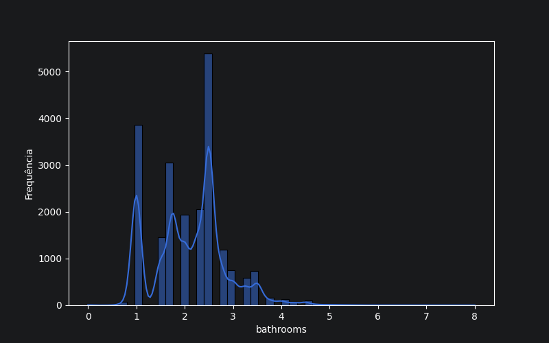 <em>Bathrooms histograma</em></td>
<td align="center" valign="top">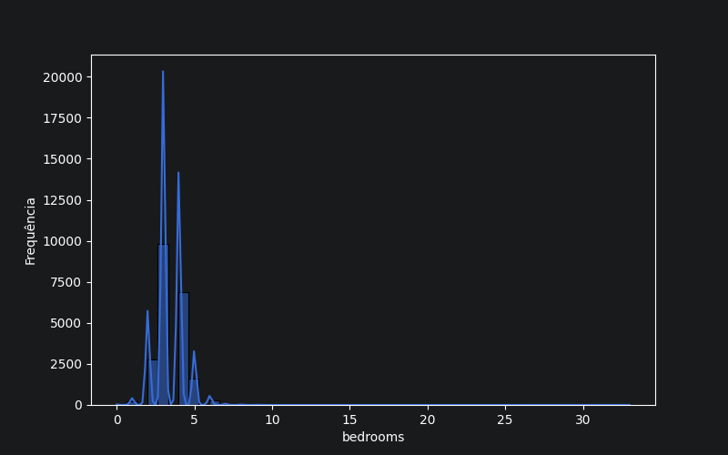 <em>Bedrooms histograma</em></td>
</tr>

<tr>
<td align="center" valign="top">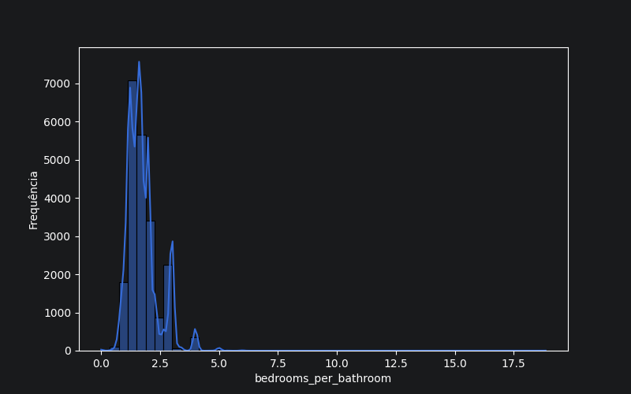 <em>Bedrooms per bathroom histograma</em></td>
<td align="center" valign="top">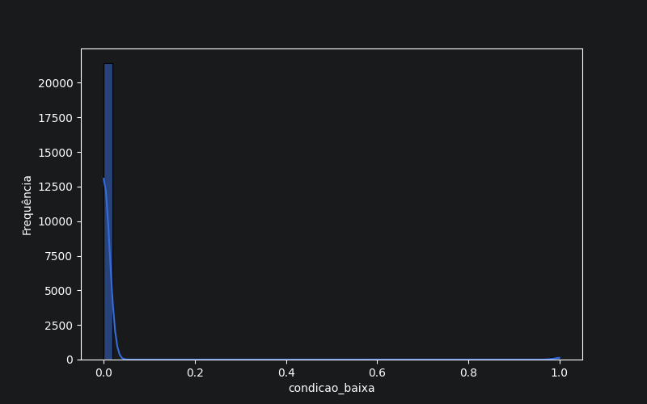 <em>Condição baixa histograma</em></td>
</tr>

<tr>
<td align="center" valign="top">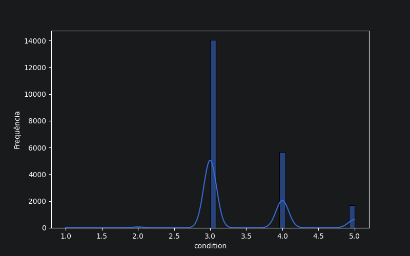 <em>Condition histograma</em></td>
<td align="center" valign="top">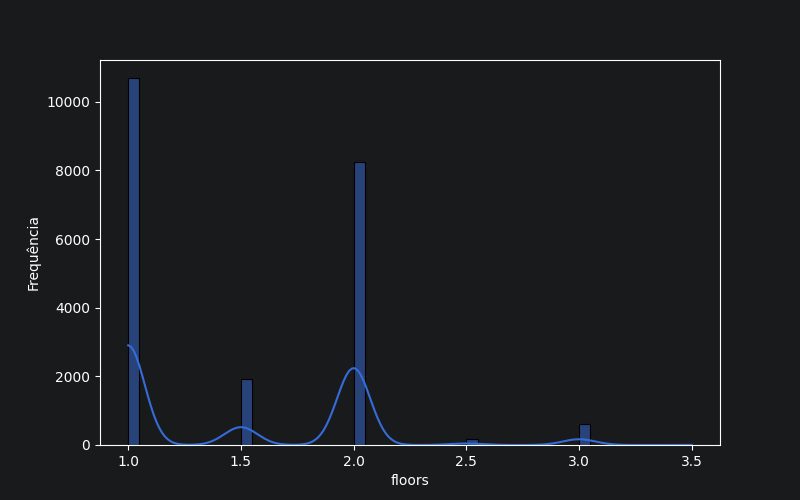 <em>Floors histograma</em></td>
</tr>

<tr>
<td align="center" valign="top">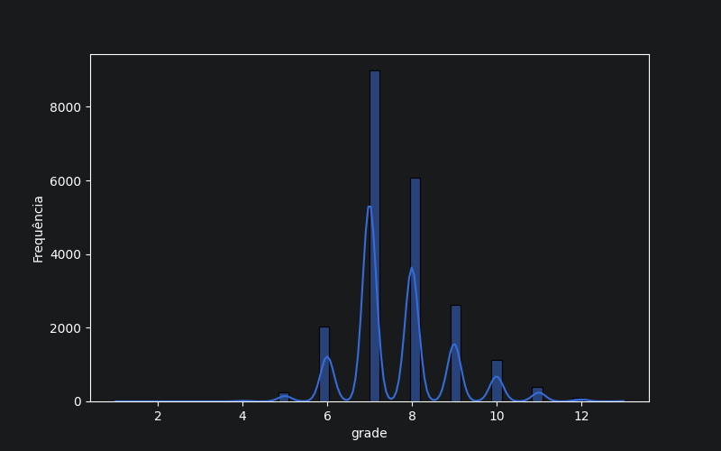 <em>Grade histograma</em></td>
<td align="center" valign="top">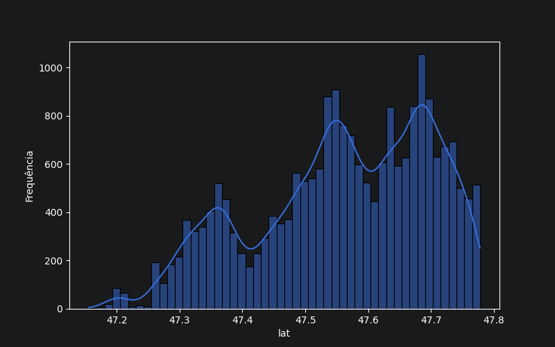 <em>Latitude histograma</em></td>
</tr>

<tr>
<td align="center" valign="top">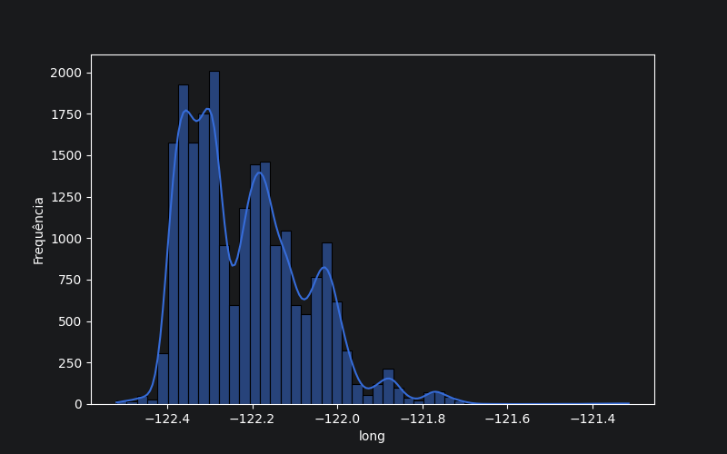 <em>Longitude histograma</em></td>
<td align="center" valign="top">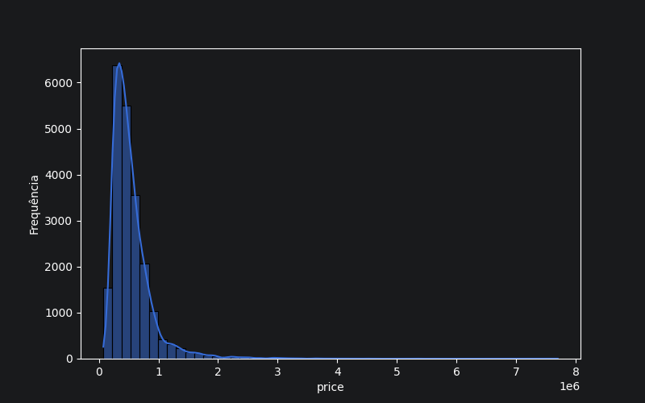 <em>Price histograma</em></td>
</tr>

<tr>
<td align="center" valign="top">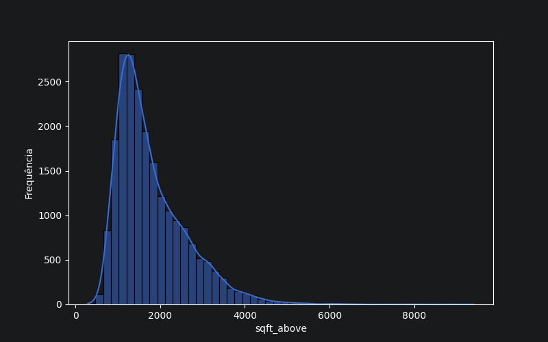 <em>Sqft above histograma</em></td>
<td align="center" valign="top">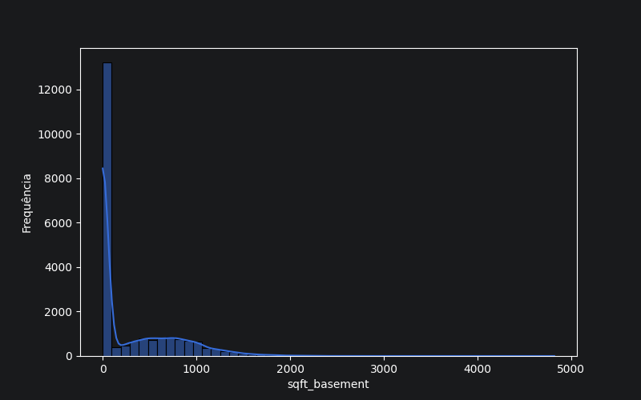 <em>Sqft basement histograma</em></td>
</tr>

<tr>
<td align="center" valign="top">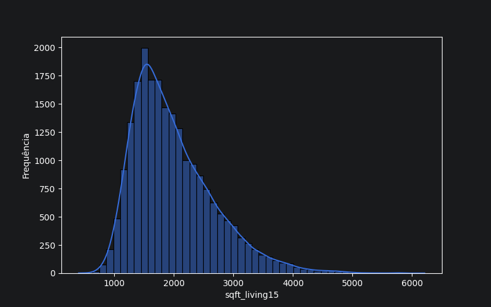 <em>Sqft living15 histograma</em></td>
<td align="center" valign="top">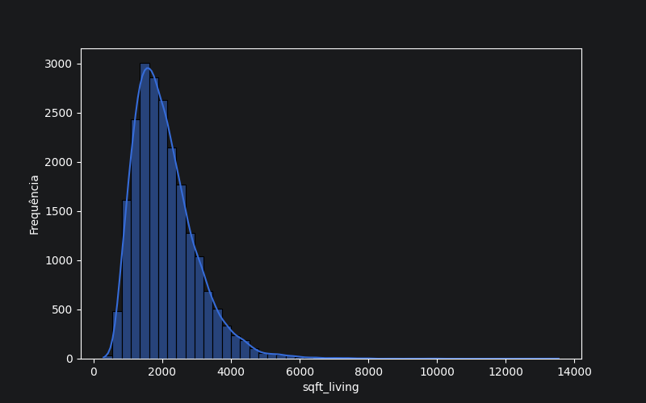 <em>Sqft living histograma</em></td>
</tr>

<tr>
<td align="center" valign="top">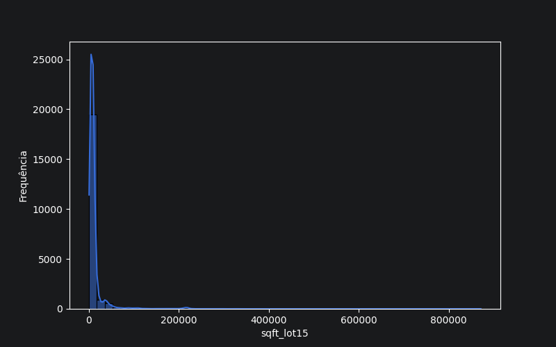 <em>Sqft lot15 histograma</em></td>
<td align="center" valign="top">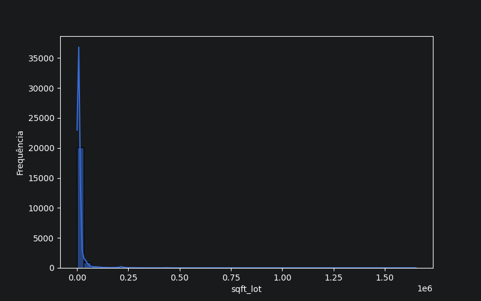 <em>Sqft lot histograma</em></td>
</tr>

<tr>
<td align="center" valign="top">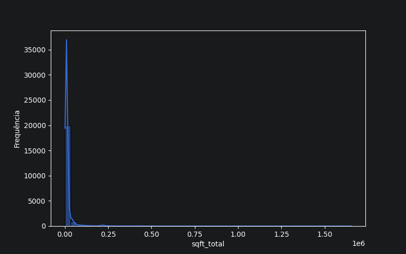 <em>Sqft total histograma</em></td>
<td align="center" valign="top">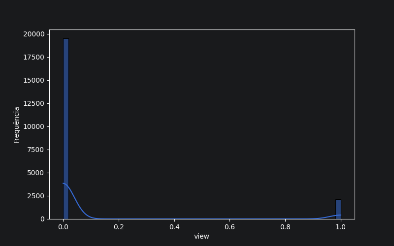 <em>View histograma</em></td>
</tr>

<tr>
<td align="center" valign="top">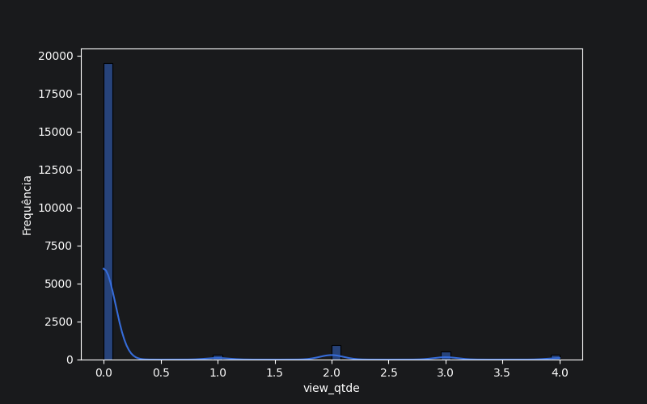 <em>View quantidade histograma</em></td>
<td align="center" valign="top">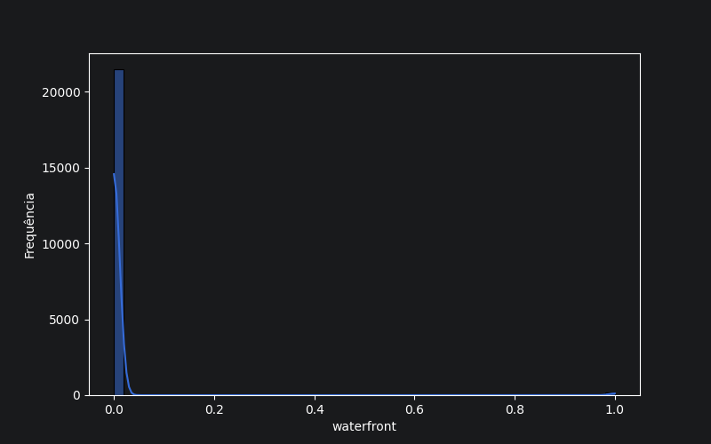 <em>Waterfront histograma</em></td>
</tr>

<tr>
<td align="center" valign="top">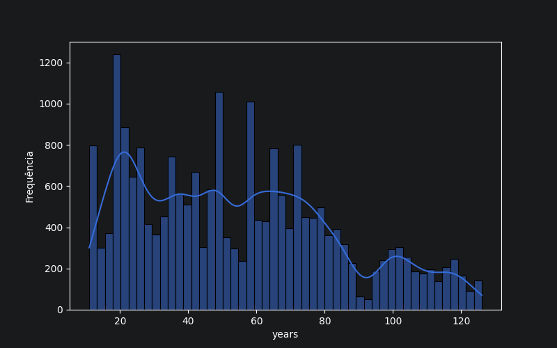 <em>Years histograma</em></td>
<td align="center" valign="top">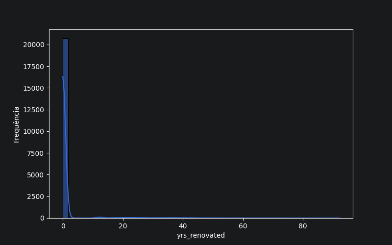 <em>Years renovated histograma</em></td>
</tr>
</table>

As variáveis `bedrooms`, `bathrooms`, `floors`, `condition` e `grade` apresentam valores mais discretos, pois representam contagens ou classificações. Já variáveis relacionadas à área possuem maior variação e apresentam valores extremos mais evidentes.

---

### 1.5 Correlações entre as variáveis

Para analisar a relação linear entre as variáveis numéricas, foi utilizado um mapa de calor de correlação. A matriz de correlação permite identificar quais atributos possuem maior relação com o preço dos imóveis.

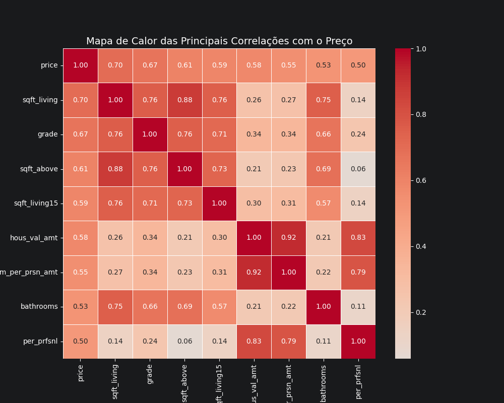

<em>Mapa de calor das principais correlações com o preço.</em>

A análise mostrou que variáveis como `sqft_living`, `grade`, `sqft_above`, `sqft_living15` e `bathrooms` apresentam forte relação positiva com `price`. Isso indica que imóveis com maior área habitável, melhor qualidade construtiva e maior número de banheiros tendem a ter preços mais altos.

Também é possível observar correlações entre variáveis explicativas, como `sqft_living`, `sqft_above` e `bathrooms`. Esse comportamento mostra que algumas informações estão relacionadas entre si, o que pode gerar redundância no modelo, mas também reforça padrões importantes sobre o tamanho e padrão dos imóveis.

---

### 1.6 Outliers

A análise dos boxplots mostrou a presença de outliers em diversas variáveis, principalmente nas relacionadas à área dos imóveis, como `sqft_living`, `sqft_lot`, `sqft_above` e `sqft_basement`.

Esses valores extremos podem representar imóveis reais com características diferenciadas, como terrenos muito grandes, casas de alto padrão ou propriedades fora do padrão médio da base. Por esse motivo, os outliers não foram removidos diretamente.

Foi utilizado o método IQR para identificar os limites inferior e superior de cada variável. Em seguida, aplicou-se o método de `clipping`, que limita os valores extremos aos limites calculados, reduzindo seu impacto no treinamento sem excluir registros da base.

#### Comparação antes e depois do tratamento de outliers

<table>
<tr>
<td align="center">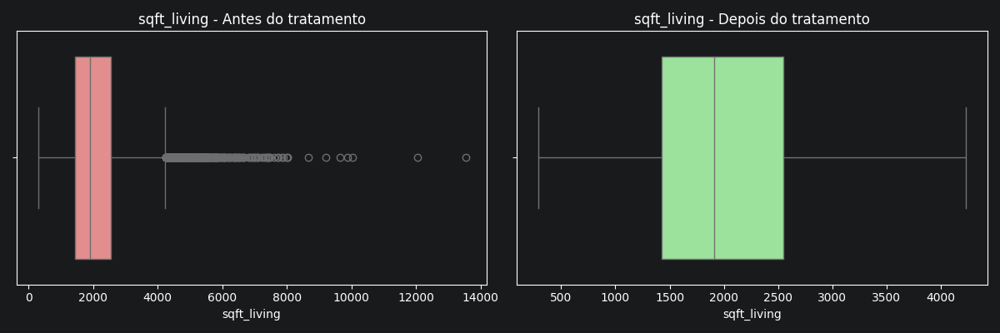 <em>sqft_living antes e depois</em></td>
<td align="center">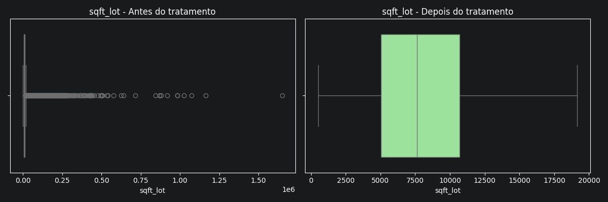 <em>sqft_lot antes e depois</em></td>
</tr>
<tr>
<td align="center">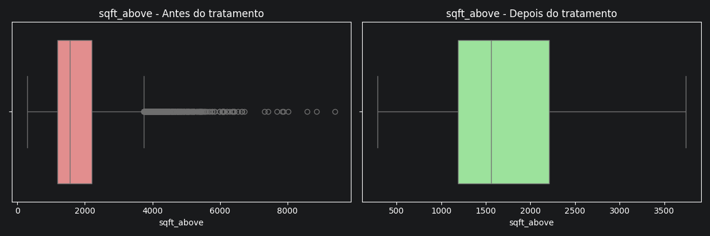 <em>sqft_above antes e depois</em></td>
<td align="center">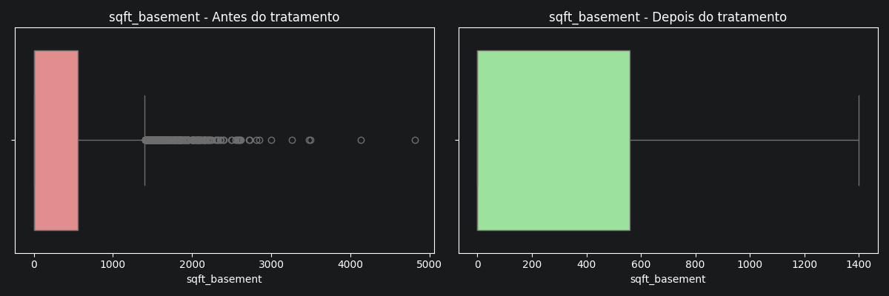 <em>sqft_basement antes e depois</em></td>
</tr>
<tr>
<td align="center">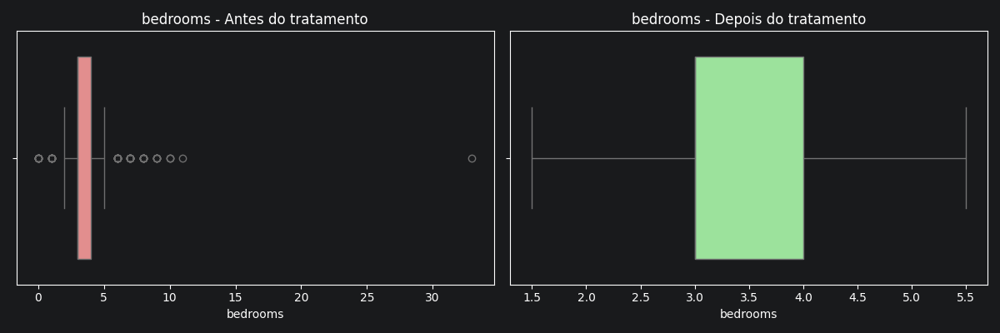 <em>bedrooms antes e depois</em></td>
<td align="center">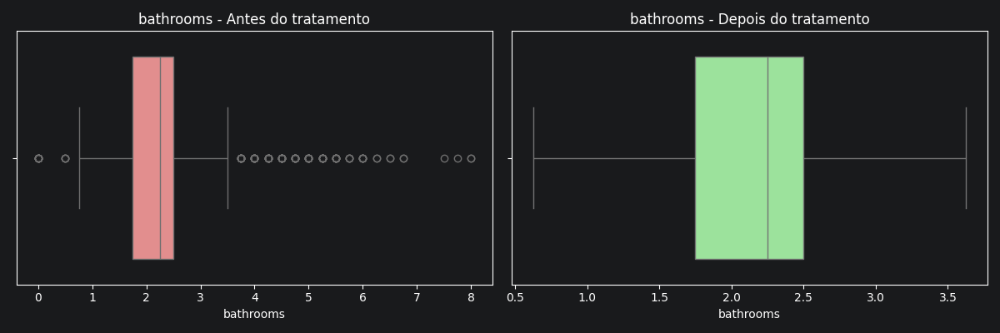 <em>bathrooms antes e depois</em></td>
</tr>
</table>

O tratamento de outliers contribuiu para tornar o treinamento mais estável, evitando que poucos valores extremos influenciassem excessivamente o modelo.

---

### 1.7 Padrões geográficos

A localização também foi analisada por meio das variáveis `lat` e `long`. Essa análise é importante porque a localização costuma ter forte influência no preço dos imóveis.

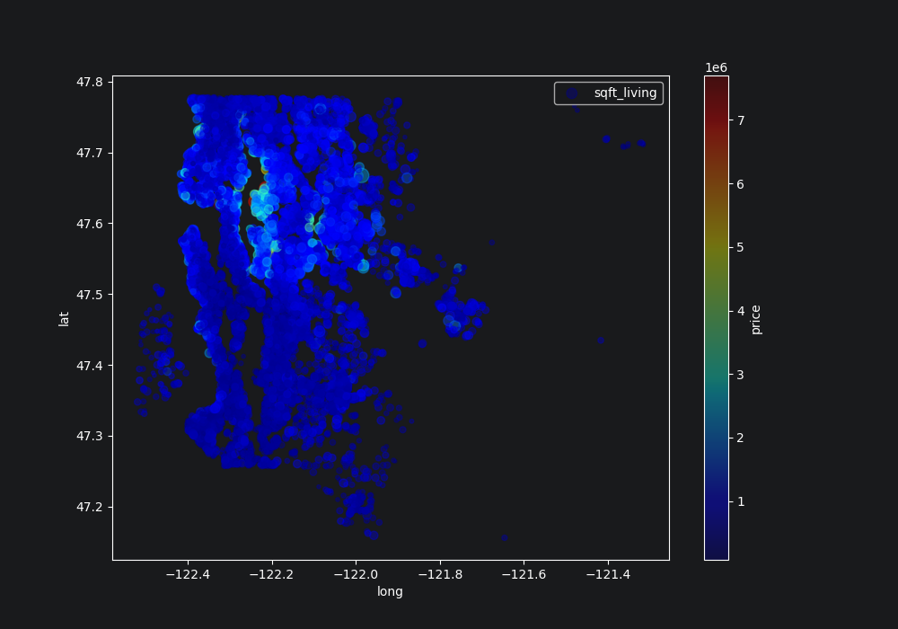

<em>Distribuição geográfica dos imóveis por latitude e longitude.</em>

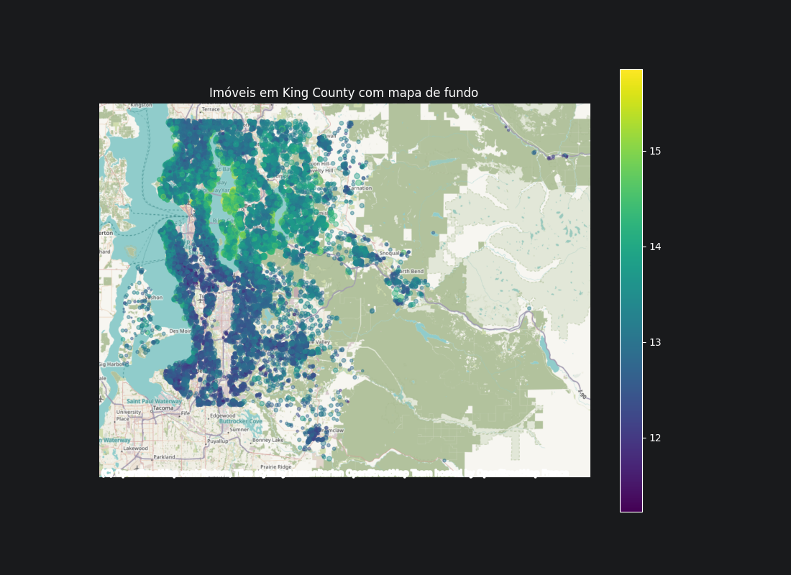

<em>Mapa dos imóveis de King County com base geográfica.</em>

Os mapas mostram que os preços não estão distribuídos de forma aleatória no espaço. Algumas regiões apresentam concentração de imóveis com valores mais altos, indicando que a localização é um fator relevante para a previsão.

---

## 2. Desenvolvimento do modelo de Machine Learning

Para resolver o problema de previsão de preços, foi desenvolvido um modelo de regressão utilizando uma rede neural MLP, respeitando o conteúdo estudado até a NP1.

---

### 2.a Variáveis importantes

A importância das variáveis foi analisada utilizando a técnica de `Permutation Importance`. Essa técnica mede a relevância de cada feature ao embaralhar seus valores e verificar quanto o desempenho do modelo piora.

Se o erro aumenta muito ao embaralhar uma variável, isso significa que ela era importante para o modelo. Se o desempenho quase não muda, significa que aquela variável teve pouca influência nas previsões.

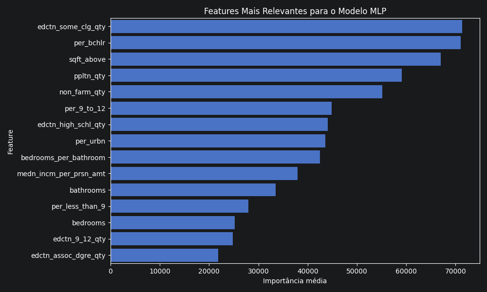

<em>Features mais relevantes para o modelo MLP.</em>

As features mais relevantes foram:

| Feature | Interpretação |
|---|---|
| `edctn_some_clg_qty` | Representa quantidade de pessoas com algum nível de ensino superior na região. |
| `per_bchlr` | Percentual de pessoas com bacharelado. |
| `sqft_above` | Área construída acima do nível do solo. |
| `ppltn_qty` | Quantidade populacional da região. |
| `non_farm_qty` | Quantidade de população não rural. |
| `bathrooms` | Quantidade de banheiros do imóvel. |
| `bedrooms` | Quantidade de quartos. |
| `bedrooms_per_bathroom` | Relação entre quartos e banheiros. |

Essas variáveis mostram que o modelo considerou tanto aspectos físicos quanto aspectos regionais. A presença de variáveis como `sqft_above`, `bathrooms` e `bedrooms` indica que tamanho e conforto do imóvel são importantes. Já variáveis como `per_bchlr`, `ppltn_qty` e `edctn_some_clg_qty` mostram que o perfil demográfico da região também contribui para explicar o preço.

Portanto, o preço dos imóveis foi influenciado por uma combinação de fatores estruturais e socioeconômicos.

---

### 2.b Escolha do modelo

O modelo escolhido foi o `MLPRegressor`, uma rede neural do tipo Multilayer Perceptron aplicada a problemas de regressão.

A escolha da MLP é adequada porque o problema envolve prever um valor numérico contínuo, ou seja, o preço do imóvel. Além disso, a MLP consegue capturar relações não lineares entre as variáveis, o que é importante em problemas imobiliários, pois o preço não depende de apenas um fator isolado.

O modelo foi implementado dentro de uma `Pipeline`, contendo:

1. `StandardScaler`, para normalizar as variáveis de entrada;
2. `MLPRegressor`, para realizar a previsão dos preços.

A normalização é importante porque redes neurais são sensíveis à escala dos dados. Como as variáveis possuem escalas muito diferentes, por exemplo `bedrooms` com valores pequenos e `sqft_lot` com valores muito maiores, o `StandardScaler` ajuda o modelo a treinar de forma mais estável.

O primeiro modelo MLP apresentou os seguintes resultados:

| Métrica | Resultado |
|---|---:|
| MAE | US$ 98.992,58 |
| RMSE | US$ 185.790,63 |
| R² | 0,7609 |

Depois, foi aplicado `GridSearchCV` para ajustar os hiperparâmetros. Os melhores parâmetros encontrados foram:

| Parâmetro | Melhor valor |
|---|---|
| `mlp__alpha` | 0.001 |
| `mlp__hidden_layer_sizes` | `(64, 32)` |
| `mlp__learning_rate_init` | 0.01 |

Com o modelo otimizado, os resultados melhoraram:

| Métrica | Resultado |
|---|---:|
| MAE | US$ 83.826,57 |
| RMSE | US$ 159.832,61 |
| R² | 0,8230 |

O aumento do R² e a redução do MAE e RMSE indicam que o ajuste de hiperparâmetros melhorou o desempenho do modelo.

---

### 2.c Generalização do modelo

Para garantir que o modelo generaliza bem para novos dados, foram utilizadas algumas estratégias.

Primeiro, a base foi dividida em treino e teste usando `train_test_split`. O conjunto de treino foi usado para ajustar o modelo, enquanto o conjunto de teste foi reservado para avaliar o desempenho em dados não vistos durante o treinamento.

Essa separação evita avaliar o modelo apenas nos dados que ele já conhece. Assim, é possível medir melhor sua capacidade de prever preços de novos imóveis.

Além disso, foi utilizada validação cruzada com 5 divisões. A validação cruzada treina e avalia o modelo em diferentes partes da base, permitindo verificar se o desempenho é consistente em diferentes amostras.

O resultado da validação cruzada foi:

| Métrica | Resultado |
|---|---:|
| MAE médio | US$ 83.773,92 |
| Desvio padrão | US$ 4.465,36 |

O desvio relativamente baixo indica que o modelo apresentou desempenho estável nas diferentes divisões da validação cruzada.

Também foi usada regularização por meio do parâmetro `alpha` do `MLPRegressor`. A regularização ajuda a reduzir overfitting, penalizando pesos muito altos na rede neural. Além disso, foi utilizado `early_stopping=True`, que interrompe o treinamento quando o desempenho de validação deixa de melhorar.

Essas estratégias ajudam o modelo a não apenas memorizar os dados de treino, mas aprender padrões que possam ser aplicados em novos imóveis.

---

### 2.1 Avaliação visual do modelo

#### Curva de perda

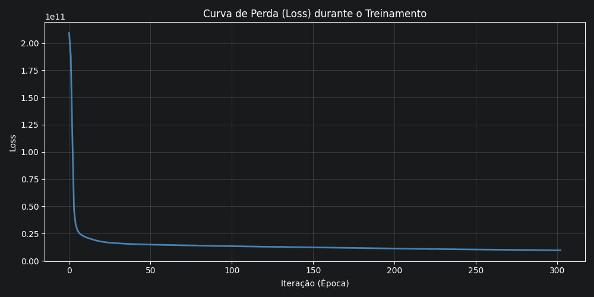

<em>Curva de perda durante o treinamento da MLP.</em>

A curva de perda mostra que o erro foi reduzido ao longo do treinamento, indicando que a rede neural conseguiu aprender padrões nos dados.

#### Preço real versus preço previsto

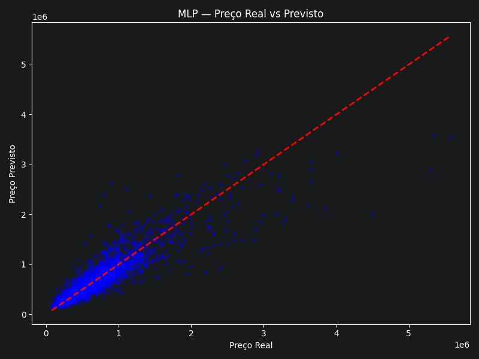

<em>Comparação entre preço real e preço previsto.</em>

O gráfico compara os valores reais com os valores previstos. Quanto mais próximos os pontos estão da linha diagonal, melhor é a previsão. O modelo conseguiu acompanhar a tendência geral dos preços, embora ainda apresente maior dificuldade em imóveis de valor muito alto.

#### Distribuição dos erros

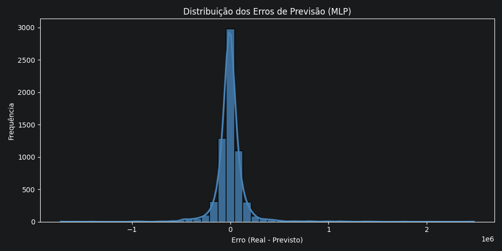

<em>Distribuição dos erros de previsão.</em>

A distribuição dos erros mostra que grande parte das previsões ficou próxima do valor real. A maior concentração próxima de zero indica bom desempenho geral, mas a presença de caudas mostra que ainda existem casos com erros maiores.

---

### 2.2 Previsão em dados futuros

Após o treinamento e avaliação, o modelo foi aplicado ao arquivo `future_unseen_examples.csv`, que contém imóveis sem preço informado.

Antes da previsão, o conjunto futuro passou pelas mesmas transformações aplicadas ao conjunto de treino, incluindo criação de `years`, `yrs_renovated`, `bedrooms_per_bathroom`, `view_qtde`, `sqft_total` e `condicao_baixa`.

Depois disso, as colunas foram organizadas na mesma ordem usada no treinamento, garantindo compatibilidade com o modelo.

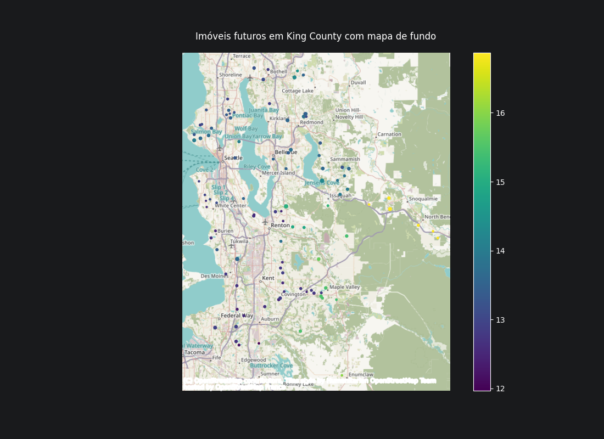

<em>Mapa dos imóveis futuros com preço previsto.</em>

O mapa permite visualizar espacialmente os imóveis futuros e os preços estimados pelo modelo.

---

## 3. Conclusão

O projeto desenvolveu uma solução completa para previsão de preços de imóveis utilizando dados físicos e demográficos. A análise dos dados mostrou que variáveis relacionadas à área, qualidade da construção, número de banheiros, localização e perfil socioeconômico da região possuem influência importante no preço.

O modelo escolhido foi uma rede neural MLP, capaz de capturar relações não lineares entre as variáveis. Com o uso de normalização, ajuste de hiperparâmetros, validação cruzada, regularização e separação entre treino e teste, o modelo apresentou boa capacidade de generalização.

O resultado final apresentou R² de 0,8230, indicando que o modelo conseguiu explicar uma parte significativa da variação dos preços dos imóveis.